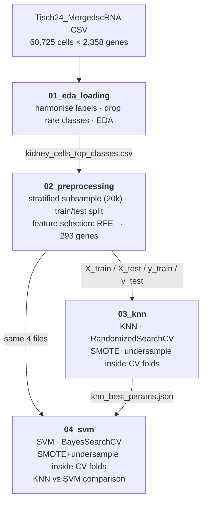

# Kidney Cell-Type Classification from Single-Cell RNA-seq

Classifying human kidney cell types from single-cell gene expression — a leakage-free, CPU-reproducible ML pipeline (KNN vs. SVM), packaged and deployed as a live serving API with an interactive demo.

[](https://github.com/shiva-shivanibokka/Tisch-ML-Model/actions/workflows/ci.yml)
[](LICENSE)


### 🔬 [Live demo → tisch-kidney-classifier.fly.dev](https://tisch-kidney-classifier.fly.dev/)

Click a real held-out kidney cell (or draw a random one) and the deployed model predicts its type in real time — showing the predicted cell type (✓/✗ against the true label), the top-3 most likely types with probabilities, and the cell's 293-gene expression signature. *(Hosted on Fly.io; the machine sleeps when idle, so the first request may take a few seconds to wake it.)*

---

## Recruiter TL;DR

- **What it does:** Takes ~60,000 single kidney cells (each described by 2,358 gene expression values, pooled from five independent published studies) and trains machine-learning models to predict each cell's type — then serves the winning model behind a REST API and interactive web demo.
- **Hardest problem solved:** Doing the evaluation *honestly* on heavily imbalanced biological data. Class balancing (SMOTE + majority undersampling) is applied **inside each cross-validation fold**, not before the split — eliminating a common data-leakage trap that had previously inflated the cross-validated score to ~0.98 while the true test performance was far lower.
- **Impact / result:** The fixed pipeline is reproducible end-to-end (SVM **CV 0.80 ≈ test 0.80 weighted F1**, ROC-AUC **0.97** — CV matching test proves no leakage), and the model is **[live and serving predictions](https://tisch-kidney-classifier.fly.dev/)** on Fly.io.

---

## Table of Contents

- [Overview & Motivation](#overview--motivation)
- [Results](#results)
- [Architecture](#architecture)
- [Serving & Deployment](#serving--deployment)
- [Skills Demonstrated](#skills-demonstrated)
- [Tech Stack](#tech-stack)
- [Getting Started](#getting-started)
- [Project Structure](#project-structure)
- [The Dataset](#the-dataset)
- [The Five Studies & Label Harmonisation](#the-five-studies--label-harmonisation)
- [Pipeline in Detail](#pipeline-in-detail)
- [Key Design Decisions](#key-design-decisions)
- [Testing & Reproducibility](#testing--reproducibility)
- [Deployment](#deployment)
- [Roadmap / Future Work](#roadmap--future-work)
- [License](#license)

---

## Overview & Motivation

Single-cell RNA sequencing (scRNA-seq) measures gene expression in individual cells. Every cell carries the same DNA, but different cell types switch on different genes — and that expression pattern is what distinguishes a proximal tubule cell from a T cell. Traditionally, scientists label cell types by hand using known marker genes: accurate, but slow and expertise-heavy. With datasets of tens of thousands of cells from multiple studies, machine learning offers a way to learn those expression patterns and classify cells automatically.

This project is an **educational, end-to-end applied-ML walkthrough** built around that problem. It is intentionally scoped for clarity over state-of-the-art accuracy — the goal is to demonstrate the full workflow (loading, EDA, leakage-safe preprocessing, feature selection, hyperparameter tuning, evaluation, model comparison) done *correctly*, with every step explained in plain language alongside the code. Dedicated single-cell tools (Seurat, scANVI) achieve higher accuracy; standard ML models are used here deliberately because the point is the process.

> **Note on scope:** results are modest by design. This is a teaching pipeline, not a production cell-type classifier.

---

## Results

All numbers below come directly from executing the notebooks in this repo (`random_state=42`, top-10 cell types, 20,000-cell stratified subsample → 16,000 train / 4,000 test, 293 selected genes).

### Model comparison (held-out test set)

| Model | Weighted F1 | ROC-AUC | Precision | Recall |
|---|---|---|---|---|
| KNN (tuned: k=24, manhattan, distance) | 0.6338 | 0.9143 | 0.7835 | 0.5748 |
| **SVM (tuned: RBF, C≈17.8, γ≈3.3e-4)** | **0.8036** | **0.9691** | **0.8323** | **0.7877** |

**SVM wins on all four metrics.**

### Why these numbers are trustworthy (leakage-free evaluation)

Because class balancing happens *inside* the cross-validation loop, the cross-validated score is an honest estimate — and it lands right next to the held-out test score:

| Model | Cross-val Weighted F1 | Test Weighted F1 |
|---|---|---|
| KNN | 0.5974 | 0.6338 |
| SVM | 0.8005 | 0.8036 |

A large gap between CV and test is the classic signature of leakage; here there is none. (An earlier version that oversampled *before* cross-validation reported a CV score near 0.98 — a textbook example of the trap this pipeline is built to avoid.)

### Baseline → tuned

| Model | Baseline F1 | Tuned F1 | Baseline AUC | Tuned AUC |
|---|---|---|---|---|
| KNN | 0.5974 | 0.6338 | 0.8615 | 0.9143 |
| SVM | 0.7890 | 0.8036 | 0.9711 | 0.9691 |

### Per-class F1 (test set)

The models are strong on well-represented, transcriptionally distinct types and weak on rare, closely-related tubule subtypes — biologically expected.

| Cell Type | KNN F1 | SVM F1 | Test cells |
|---|---|---|---|
| T cells | 0.875 | **0.963** | 274 |
| Endothelium | 0.773 | **0.940** | 189 |
| Proximal Tubule | 0.774 | **0.890** | 1,979 |
| Myeloid | 0.798 | **0.863** | 208 |
| Collecting Duct Principal | 0.358 | **0.733** | 359 |
| Ascending Thin Limb | 0.348 | **0.710** | 247 |
| Thick Ascending Limb | 0.325 | **0.637** | 218 |
| Collecting Duct Intercalated | 0.444 | **0.580** | 234 |
| Loop of Henle & Parietal Epithelium | 0.167 | **0.429** | 147 |
| Distal Convoluted Tubule | 0.262 | **0.379** | 145 |

### Feature reduction

| Stage | Genes remaining |
|---|---|
| Original gene columns | 2,358 |
| After zero-variance removal | 2,350 |
| After high-null removal (>90%) | 2,350 |
| After VarianceThreshold (0.01) | 2,350 |
| **After RFE (best k=293)** | **293** |

---

## Architecture

Four notebooks run in sequence, each writing artefacts the next one reads. This staged design keeps every step independently inspectable and makes the KNN-vs-SVM comparison strictly fair (both models consume the identical train/test split and feature set).



**Where the correctness lives.** Notebook 2 fits *every* preprocessing step (zero-variance removal, StandardScaler, VarianceThreshold, RFE ranking) on the **training split only** and applies it to the test split — never the reverse. It deliberately does **not** balance the classes; instead, Notebooks 3 and 4 wrap `RandomUnderSampler` + `SMOTE` in an `imblearn.Pipeline` so balancing is re-fit on the training portion of **each cross-validation fold**. The test set is never resampled and reflects the real, imbalanced class distribution.

---

## Serving & Deployment

The same pipeline is packaged (`src/kidney_scrna/`) and served. `train.py` runs the whole thing headless and exports a **compact, deployable model** — a `StandardScaler → RBF-SVC` pipeline over just the 293 selected genes (12.7 MB). SMOTE + undersampling are applied *only while training*; they are **not** part of the served pipeline, which takes raw gene-expression values and returns calibrated class probabilities.

A **[FastAPI](https://tisch-kidney-classifier.fly.dev/) service** exposes it:

| Endpoint | Method | Returns |
|---|---|---|
| `/` | GET | Interactive demo page (see below) |
| `/health` | GET | Liveness probe (`{status, model_available}`) |
| `/model` | GET | Metadata: model type, the 293 genes, 10 class labels, test metrics |
| `/predict` | POST | `{features: {gene: value, …}}` → `{prediction, confidence, top3, model_type}` |

The **demo page** (`/`) is a self-contained single-page UI: click a real held-out cell (one per cell type) or draw a random one, and the result renders inline right below the picker — the predicted cell type with a ✓/✗ against the true label, the **top-3** most likely types with probabilities, and the cell's **293-gene expression signature** (each gene z-scored against the training average; cyan = under-expressed, red = over-expressed). It also surfaces header stat tiles (Test F1 0.804, ROC-AUC 0.969, 293 genes, 10 cell types) and a per-class F1 panel. Every prediction is logged as a structured JSON line. The service is containerised (`Dockerfile`) and **deployed live on Fly.io** (`fly.toml`), built via Fly's remote builder — the 120 MB image bakes in only the model + demo samples; the 292 MB dataset is never shipped.

```bash
python train.py                              # train + export artifacts/ (~35 min CPU; --quick for a smoke test)
uvicorn kidney_scrna.serve:app --reload      # run the API + demo locally at http://localhost:8000
pytest                                       # run the test suite
fly deploy                                   # deploy to Fly.io
```

---

## Skills Demonstrated

- **Production ML deployment / MLOps** — a headless training CLI that exports a versioned model artifact, a serving layer decoupled from the training/notebook code, and a live containerised deployment on a cloud host.
- **RESTful API design** — a FastAPI service with health, metadata, and prediction endpoints, request validation, typed responses, and structured JSON logging.
- **Containerization & cloud deployment** — Docker image (non-root, minimal) deployed to **Fly.io** via a remote builder, with a `/health` check and scale-to-zero configuration.
- **Data engineering / ETL pipeline design** — a staged pipeline that moves raw 292 MB scRNA-seq data through cleaning, label harmonisation across five heterogeneous studies, and feature selection into a model-ready form, with artefacts passed between stages.
- **Rigorous ML evaluation & data-leakage prevention** — fit-on-train-only preprocessing and per-fold resampling inside `imblearn` pipelines; CV/test agreement used as the correctness check.
- **Feature selection on high-dimensional data** — Recursive Feature Elimination with a fast SGD-trained linear-SVM ranker, reducing 2,358 sparse gene features to 293.
- **Class-imbalance handling** — combined SMOTE oversampling + majority undersampling to a fixed per-class cap.
- **Hyperparameter optimisation** — `RandomizedSearchCV` (KNN) and Bayesian optimisation via `BayesSearchCV` / scikit-optimize (SVM).
- **Automated testing & CI/CD** — a `pytest` suite covering the data, feature-selection, model, evaluation, and API layers (including FastAPI `TestClient` tests), run automatically on every push via a GitHub Actions pipeline.
- **Model evaluation & comparison** — weighted F1, ROC-AUC (one-vs-rest), per-class precision/recall, confusion matrices, ROC curves, and a fair head-to-head model comparison.
- **System design & communication** — documented design decisions and trade-offs; every step explained for a learning audience.

---

## Tech Stack

CPU-only and reproducible from `requirements.txt` — no GPU required. The package installs with `pip install -e .` (see [`pyproject.toml`](pyproject.toml)).

| Library / Tool | Role |
|---|---|
| `pandas`, `numpy` | Data loading and manipulation |
| `scikit-learn` | KNN, SVM, preprocessing, feature selection, metrics, CV search |
| `imbalanced-learn` | `SMOTE` + `RandomUnderSampler` inside CV pipelines |
| `scikit-optimize` | `BayesSearchCV` (Bayesian hyperparameter search for the SVM) |
| `scipy` | Sampling distributions for randomised search |
| `matplotlib`, `seaborn` | EDA plots, confusion matrices, ROC curves |
| `FastAPI`, `uvicorn`, `pydantic` | Serving API + interactive demo, request validation |
| `joblib` | Model serialization (the deployed artifact) |
| `pytest` | Test suite (data, features, models, evaluation, API) |
| `Docker`, `Fly.io` | Containerization and live cloud deployment |

Exact pinned versions are in [`requirements.txt`](requirements.txt).

---

## Getting Started

**Prerequisites:** Python 3.10+ and the dataset file `Tisch24_MergedscRNA_80-85PctVAR.csv` (292 MB) placed in the repo folder. (The CSV is git-ignored due to size.)

```bash
# 1. Clone and enter the repo
git clone https://github.com/shiva-shivanibokka/Tisch-ML-Model.git
cd Tisch-ML-Model

# 2. (Recommended) create a virtual environment
python -m venv .venv
source .venv/bin/activate        # Windows: .venv\Scripts\activate

# 3. Install dependencies (or `pip install -e .` to also install the package)
pip install -r requirements.txt

# 4. Put the dataset CSV in this folder, then launch Jupyter
jupyter lab
```

Run the notebooks **in order** — `01` → `02` → `03` → `04`. Each writes intermediate CSVs (git-ignored) that the next reads. By default `data_dir = Path('.')` (the repo folder); on Google Colab instead, mount Drive and point `data_dir` at your Drive folder (a commented snippet is included in each notebook's setup cell).

To train and serve the model instead of stepping through the notebooks, see [Serving & Deployment](#serving--deployment) (`python train.py` → `uvicorn kidney_scrna.serve:app`).

To run headlessly:

```bash
jupyter nbconvert --to notebook --execute --inplace 01_eda_loading.ipynb
jupyter nbconvert --to notebook --execute --inplace 02_preprocessing.ipynb
jupyter nbconvert --to notebook --execute --inplace 03_knn.ipynb
jupyter nbconvert --to notebook --execute --inplace 04_svm.ipynb
```

> The SVM notebook is the slow step (RBF-SVM cost grows quickly with training size); balancing is capped at `CAP = 1000` cells/class to keep it tractable on CPU.

---

## Project Structure

```
Tisch-ML-Model/
├── 01_eda_loading.ipynb        # Teaching notebook: load, harmonise, drop rare classes, EDA
├── 02_preprocessing.ipynb      # Teaching notebook: subsample, split, leakage-safe reduction → 293 genes
├── 03_knn.ipynb                # Teaching notebook: KNN + RandomizedSearchCV
├── 04_svm.ipynb                # Teaching notebook: SVM + BayesSearchCV, KNN-vs-SVM comparison
│
├── src/kidney_scrna/           # Installable package (the notebook logic, reusable + tested)
│   ├── config.py               #   paths, constants, label map
│   ├── data.py                 #   load / clean / harmonise / subsample / split
│   ├── features.py             #   leakage-free reduction + SGD-ranked RFE
│   ├── models.py               #   KNN/SVM search pipelines + deployable-model builder
│   ├── evaluate.py             #   metrics (weighted F1, ROC-AUC, per-class)
│   └── serve.py                #   FastAPI app + interactive demo page
├── train.py                    # Headless CLI: run pipeline → export artifacts/
├── artifacts/                  # model.joblib (served), metrics.json, examples.json (demo samples)
├── tests/                      # pytest suite (data, features, models, evaluate, API)
│
├── Dockerfile, .dockerignore   # Container image (bakes the model, not the dataset)
├── fly.toml                    # Fly.io deployment config
├── pyproject.toml              # Package metadata (`pip install -e .`)
├── requirements.txt            # Pinned dependencies (CPU-only)
├── LICENSE                     # MIT
├── .gitignore                  # Excludes the 292 MB dataset + generated intermediate files
└── README.md
```

The four notebooks remain the **teaching pipeline** (every step explained); `src/kidney_scrna/` is the same logic factored into a tested, importable, and deployable package. Generated at runtime (git-ignored): `kidney_cells_clean.csv`, `kidney_cells_top_classes.csv`, `X_train.csv`, `X_test.csv`, `y_train.csv`, `y_test.csv`, `knn_best_params.json`.

---

## The Dataset

**File:** `Tisch24_MergedscRNA_80-85PctVAR.csv` · **Size:** 292 MB · **Rows:** 60,725 (one per cell) · **Columns:** 2,367 (9 metadata + 2,358 gene expression).

The name refers to the TISCH2 database (Tumor Immune Single-cell Hub, 2024). "80–85% VAR" means it was pre-filtered to the genes explaining 80–85% of total variance across cells, keeping the file manageable while retaining the most informative genes.

**Metadata columns:** `Cell_ID`, `nCount_RNA`, `nFeature_RNA`, `StudyOrigin_Author`, `percent.mt`, `Sex`, `Sampling_Location`, `Age`, and `Cell_Labels` (the target).

**Sparsity.** ~96–97% of gene values in any given cell are zero — a biological reality (most genes are silent at any moment), not a data-quality issue. On average a cell has fewer than 100 non-zero genes out of 2,358. This is why variance-based filtering and feature selection matter.

---

## The Five Studies & Label Harmonisation

The dataset merges five independent human-kidney studies, each with different protocols and naming conventions:

| Study | Cells | Notes |
|---|---|---|
| Menon | 22,264 | Largest contributor — healthy donor kidneys |
| Liao | 14,880 | Includes immune populations |
| Lake | 13,255 | Broad coverage across cortex and medulla |
| Young | 6,067 | Includes rare immune types |
| Wu | 4,259 | Diabetic kidney disease; abbreviated cell-type labels |

The Wu study abbreviated cell types (e.g. `PT` for proximal tubule). Without harmonisation, a model would treat `PT` and `Proximal Tubule` as different classes. Notebook 1 applies six mappings (`PT`→Proximal Tubule, `DT`→Distal Convoluted Tubule, `LH`→Loop of Henle and Parietal Epithelium, `PC`→Collecting Duct Principal, `IC`→Collecting Duct Intercalated, `P`→Glomerular Epithelium and Podocytes), reducing 31 raw labels to 25.

**Rare classes removed** (fewer than 100 cells — too few to learn or to split reliably): Plasmacytoid (19), Mast (22), Neutrophil (83). This leaves **22 classes / 60,601 cells**. The modelling notebooks focus on the **top-10 most abundant classes** (50,218 cells) so the pipeline runs quickly and the minority classes still have enough examples to evaluate.

---

## Pipeline in Detail

### Notebook 1 — EDA & Loading
Loads the raw CSV, harmonises labels, removes rare classes, and produces EDA visualisations (class distribution, missing-value profile, genes-per-cell, sparsity per cell and per cell type). Saves `kidney_cells_clean.csv` (22 classes) and `kidney_cells_top_classes.csv` (top 10).

### Notebook 2 — Preprocessing & Feature Selection
**Preventing data leakage** is the guiding principle: every step is fit on the training split and applied to the test split.

1. **Stratified subsample** of 20,000 cells (preserving class proportions) → 80/20 split into 16,000 train / 4,000 test.
2. **Zero-variance removal**, **high-null removal (>90%)**, **StandardScaler**, **VarianceThreshold(0.01)** — each fit on train only.
3. **Recursive Feature Elimination.** RFE needs an estimator that ranks features by importance (KNN and RBF-SVM don't expose this), so a **linear SVM trained with SGD** serves purely as the ranker. Genes are ranked once, then a sweep over `k` (scored by 3-fold CV weighted F1 on the training set) selects **k = 293**.
4. Saves the **un-resampled** `X_train/X_test/y_train/y_test` — balancing is deferred to the model notebooks to avoid leakage.

### Notebook 3 — K-Nearest Neighbours
KNN classifies a cell by the majority vote of its nearest neighbours in gene-expression space (cells of the same type cluster together). Tuned with **`RandomizedSearchCV`** (20 samples × 5-fold): `n_neighbors` 1–30, `weights` ∈ {uniform, distance}, `metric` ∈ {euclidean, manhattan, chebyshev}. Best: **k=24, manhattan, distance**. Saves `knn_best_params.json`. Outputs a classification report, confusion matrix, one-vs-rest ROC curves, and per-class F1.

### Notebook 4 — Support Vector Machine & Comparison
An RBF-SVM finds a maximum-margin decision boundary in a higher-dimensional space. Tuned with **Bayesian optimisation** (`BayesSearchCV`, 15 trials × 3-fold), which uses past trials to pick promising `C`/`gamma` values rather than sampling blindly: `C` log-uniform 0.01–100, `gamma` log-uniform 1e-4–1e-1 (capped at 0.1 to avoid the slow, over-fitting high-gamma region). Best: **C≈17.8, γ≈3.3e-4**. Reloads the KNN params and re-runs KNN under identical per-fold balancing for a fair head-to-head comparison.

In **both** model notebooks, class balancing is an `imblearn.Pipeline` step (`RandomUnderSampler` down to `CAP=1000`/class, then `SMOTE` up to `CAP`), so it is re-fit inside every CV fold and the final model — never on the test set.

---

## Key Design Decisions

- **Why SMOTE inside the CV pipeline, not before?** Oversampling before the train/validation split lets synthetic points derived from a validation cell leak into training, inflating CV scores. Wrapping resampling in an `imblearn.Pipeline` confines it to each fold's training portion. This single change is the core correctness property of the project.
- **Why a linear SVM as the RFE ranker when the models are KNN/SVM?** RFE needs importance scores; KNN has none and RBF-SVM's aren't usable by RFE. A fast SGD-trained linear SVM ranks genes cheaply, and the selected genes are handed to the actual classifiers — standard practice.
- **Why weighted F1, not accuracy?** The data is heavily imbalanced (Proximal Tubule ≈ 50% of the top-10 subset). A "always predict Proximal Tubule" model would score ~50% accuracy while learning nothing; weighted F1 rewards performance across all classes.
- **Why subsample and cap balancing?** RBF-SVM training cost grows ~quadratically with rows. A 20,000-cell stratified subsample and a per-class balancing cap keep the full pipeline runnable on a CPU in minutes while preserving class proportions and honest evaluation.
- **Why the same train/test split for both models?** Reading identical `X_train/X_test/y_train/y_test` files guarantees the KNN-vs-SVM comparison is fair.

---

## Testing & Reproducibility

The `src/kidney_scrna/` package has a **`pytest` suite** (`tests/`) covering the data, feature-selection, model, and evaluation modules, plus the API (via FastAPI's `TestClient`):

```bash
pytest            # runs tests/test_config.py, test_data.py, test_features.py,
                  #      test_models.py, test_evaluate.py, test_api.py
```

Correctness is further established by:

- **Fixed seeds** (`random_state=42`) throughout — `train.py` reproduces the notebooks' numbers exactly (SVM test F1 `0.8036`).
- **Leakage checks by construction** — preprocessing fit on train only; resampling confined to CV folds and the training set.
- **CV ≈ test agreement** as an empirical correctness signal (see [Results](#results)).
- **Pinned dependencies** in `requirements.txt`.

The suite runs automatically on every push and pull request via **GitHub Actions** ([`.github/workflows/ci.yml`](.github/workflows/ci.yml)).

---

## Deployment

**Live on Fly.io: [tisch-kidney-classifier.fly.dev](https://tisch-kidney-classifier.fly.dev/).** The `Dockerfile` builds a minimal non-root image (~120 MB) that bakes in the trained model and demo samples — never the 292 MB dataset. It is deployed with `fly deploy` using Fly's remote builder (no local Docker required), configured (`fly.toml`) with a `/health` check and scale-to-zero so it costs nothing while idle. See [Serving & Deployment](#serving--deployment) for the full flow.

---

## Roadmap / Future Work

- Run on the full ~50k top-10 cells (or all 22 classes) rather than a 20k subsample, given more compute.
- Add `log1p` normalisation before scaling (standard for scRNA-seq counts).
- Try a linear-kernel SVM and regularised logistic regression as high-dimensional baselines.
- Compare against purpose-built single-cell tools (Seurat label transfer, scANVI) to quantify the gap standard ML leaves on the table.
- Extend the serving API with batch prediction and simple request-rate metrics.

---

## License

Released under the [MIT License](LICENSE).

---

*Part of a series of applied-ML learning projects. A companion project applying Random Forest and XGBoost to sepsis prediction lives in the Sepsis-ML-Model repository.*
